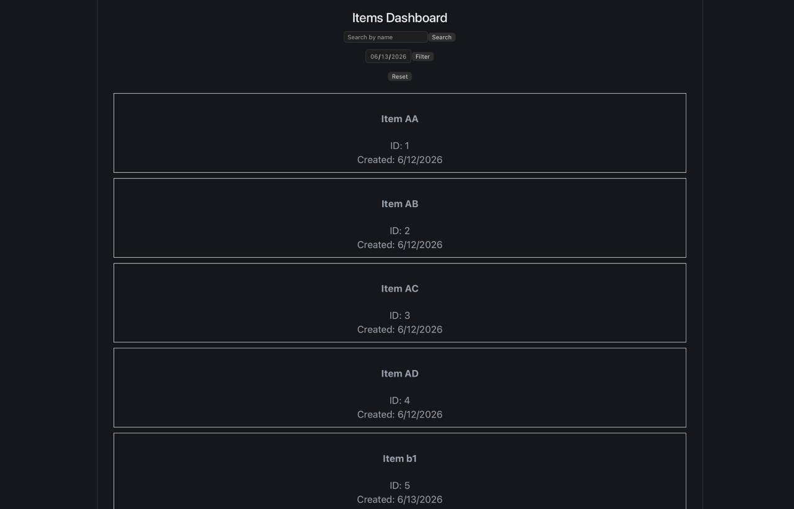
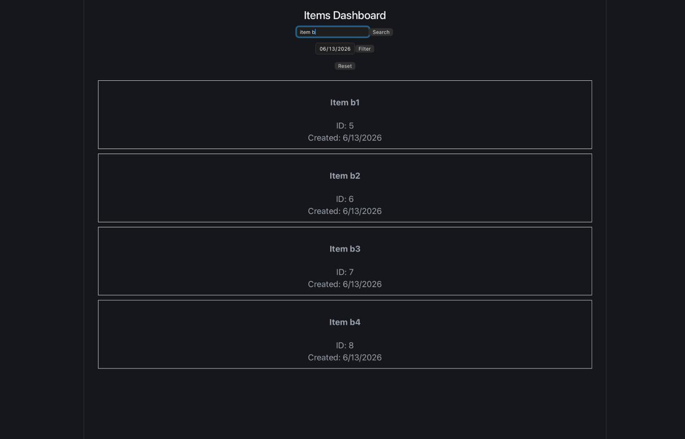
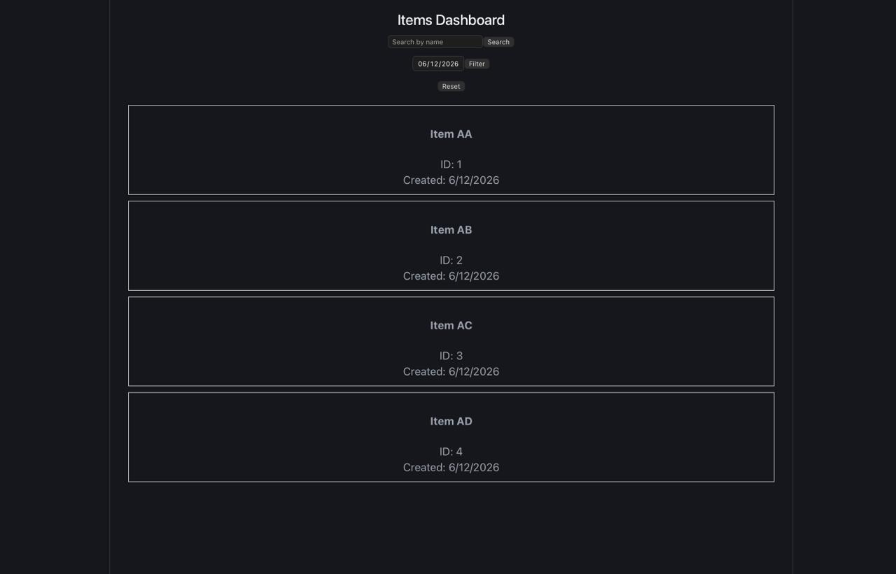

# API Reference (concise)

Base paths:
- Items: `/api/items`
- Events: `/api/events`

All responses are JSON unless noted.

---

**Items**

- GET /api/items/
  - Description: Return all items.
  - Query: none
  - Success: 200 OK
    - Body: Array of item objects
      - Example: `[{ id, name, createdAt, ... }, ...]`
  - Errors: 500 Internal Server Error -> `{ error: <message> }`

- GET /api/items/search?name=<string>
  - Description: Search items by partial `name` (LIKE %name%).
  - Query: `name` (required)
  - Success: 200 OK -> array of matching items
  - Errors: 500 -> `{ error: <message> }`

- GET /api/items/by-date?date=YYYY-MM-DD
  - Description: Return items created on `date` (UTC, uses start-of-day to next day exclusive).
  - Query: `date` (required, ISO date string)
  - Success: 200 OK -> array of items
  - Errors: 500 -> `{ error: <message> }`

---

**Events**

- POST /api/events/create-event
  - Description: Create an event (multipart/form-data).
  - Content-Type: `multipart/form-data`
  - Form fields (required):
    - `name` (string) - min length 3
    - `eventType` (string) - one of: COMEDY, SEMINAR, WORKSHOP, SPORTS, HACKATHON, CONCERT
    - `eventDate` (string/date)
    - `Venue` (string)
    - `Description` (string)
  - File fields:
    - `banner` (file) - single file (field name `banner`)
  - Validation layers:
    1. Multer parses `multipart/form-data` and provides `req.files`.
    2. `express-validator` (route) enforces `name` length and `eventType` allowed values.
    3. Controller-level check rejects any empty required fields.
    4. Cloudinary upload: file is uploaded; failure returns 404 error.
  - Success: 201 Created
    - Body: created event object (database record)
  - Failure cases:
    - 400 Bad Request -> validation errors: `{ errors: [ { msg, param, ... }, ... ] }`
    - 400 Bad Request -> controller missing fields: `{ success:false, message: "fill all the event details" }`
    - 404 Not Found -> file upload failure: `{ success:false, message: "not uploaded " }`
    - 500 Internal Server Error -> `{ success:false, message: <message> }`

- DELETE /api/events/delete-event/:id
  - Description: Delete event by `id` (path param).
  - Path: `:id` (required)
  - Success: 200 OK -> `{ message: "event deleted succsessfully" }`
  - Errors:
    - 404 Not Found -> `{ success:false, message: "eevent not found" }`
    - 500 -> `{ success:false, message: <message> }`

- PATCH /api/events/update-event/:id
  - Description: Update event by `id`. Accepts `multipart/form-data` to replace `banner` and body fields to update other fields.
  - Path: `:id` (required)
  - Form fields (optional): any of `name`, `eventType`, `eventDate`, `Venue`, `Description`
  - File fields (optional): `banner` (single file) — if provided, uploaded and `bannerUrl` saved.
  - Success: 200 OK -> `{ message: "event updated succsessfully" }`
  - Errors:
    - 404 Not Found -> `{ success:false, message: "event not found" }`
    - 500 -> `{ success:false, message: <message> }`

- GET /api/events/get-events
  - Description: Return all events.
  - Success: 200 OK
    - Body: `{ Events: [ { id, Name, eventType, eventDate, Venue, bannerUrl, ... }, ... ] }`
  - Errors:
    - 404 -> `{ success:false, message: "No events listed" }` (controller throws)
    - 500 -> `{ success:false, message: <message> }`

---

Error handling (concise):
- `asyncHandler` wraps controllers and returns responses: `res.status(error.statusCode||500).json({ success:false, message: error?.message || 'Internal server error' })`.
- Route-level validation errors return `400` with `{ errors: [...] }` from `express-validator`.
- Items controller returns `500` with `{ error: <message> }` on DB errors.

Validation layers (ordered, concise):
1. Multer (middleware) — parses multipart/form-data and provides `req.files`.
2. express-validator (route) — schema checks (e.g. `name` length, `eventType` allowed values).
3. Controller-level checks — required-field presence and non-empty strings.
4. External upload (Cloudinary) — upload may fail and triggers ApiError with 404 or other status.
5. asyncHandler centralizes thrown errors to consistent JSON responses.

---

# Quick: Run Backend & Frontend (concise)

Backend (start server on port 3000):
```bash
cd backend
npm install
# set environment variables (use example.env as template)
node server.js
```

Frontend (start dev server):
```bash
cd frontend
npm install
npm run dev
```

---

Notes:
- API base paths are mounted in `backend/server.js` as `/api/items` and `/api/events`.
- All responses are JSON; errors follow the shapes described above.
Copy the example environment file and update with your database credentials:
```bash
cp example.env .env
```

Edit `.env` file with your database configuration:
```env
DB_USER=your_mysql_user
DB_PASS=your_mysql_password
DB_HOST=localhost
DB_NAME=your_database_name
```

### 4. Run Database Migrations (if available)
```bash
npx sequelize-cli db:migrate
```

### 5. Seed Database (if seeders available)
```bash
npx sequelize-cli db:seed:all
```

### 6. Start Backend Server
```bash
npm start
```

The backend server will start on **http://localhost:3000**

---

## 🎨 Frontend Setup

### 1. Navigate to Frontend Directory
```bash
cd frontend
```

### 2. Install Dependencies
```bash
npm install
```

### 3. Create Environment Variables
```bash
cp example.env .env
```

Update `.env` if needed (e.g., API base URL):
```env
VITE_API_URL=http://localhost:3000
```

### 4. Run Development Server
```bash
npm run dev
```

The frontend will be available at **http://localhost:5173**

### 5. Build for Production
```bash
npm run build
```

### 6. Preview Production Build
```bash
npm run preview
```

---

## 📡 API Documentation

### Base URL
```
http://localhost:3000/api/items
```

### API Endpoints

#### 1. Get All Items
**Endpoint:** `GET /api/items/`

**Description:** Retrieve all items from the database.

**Request:**
```http
GET /api/items/ HTTP/1.1
Host: localhost:3000
```

**Response (200 OK):**
```json
[
  {
    "id": 1,
    "name": "Item 1",
    "createdAt": "2026-06-13T10:00:00Z",
    "updatedAt": "2026-06-13T10:00:00Z"
  },
  {
    "id": 2,
    "name": "Item 2",
    "createdAt": "2026-06-13T11:00:00Z",
    "updatedAt": "2026-06-13T11:00:00Z"
  }
]
```

**Error Response (500):**
```json
{
  "error": "Error message"
}
```

---

#### 2. Search Items by Name
**Endpoint:** `GET /api/items/search?name=<search_term>`

**Description:** Search for items by name using partial matching.

**Request:**
```http
GET /api/items/search?name=task HTTP/1.1
Host: localhost:3000
```

**Query Parameters:**
- `name` (required, string): The search term to match against item names

**Response (200 OK):**
```json
[
  {
    "id": 1,
    "name": "Task Item 1",
    "createdAt": "2026-06-13T10:00:00Z",
    "updatedAt": "2026-06-13T10:00:00Z"
  }
]
```

**Error Response (500):**
```json
{
  "error": "Error message"
}
```

---

#### 3. Get Items by Date
**Endpoint:** `GET /api/items/by-date?date=<YYYY-MM-DD>`

**Description:** Retrieve all items created on a specific date.

**Request:**
```http
GET /api/items/by-date?date=2026-06-13 HTTP/1.1
Host: localhost:3000
```

**Query Parameters:**
- `date` (required, string): Date in format YYYY-MM-DD

**Response (200 OK):**
```json
[
  {
    "id": 1,
    "name": "Item Created Today",
    "createdAt": "2026-06-13T10:30:00Z",
    "updatedAt": "2026-06-13T10:30:00Z"
  },
  {
    "id": 3,
    "name": "Another Item",
    "createdAt": "2026-06-13T14:15:00Z",
    "updatedAt": "2026-06-13T14:15:00Z"
  }
]
```

**Error Response (500):**
```json
{
  "error": "Error message"
}
```

---

## 📝 API Summary Table

| Method | Endpoint | Purpose | Query Parameters |
|--------|----------|---------|------------------|
| GET | `/api/items/` | Get all items | None |
| GET | `/api/items/search` | Search items by name | `name` (required) |
| GET | `/api/items/by-date` | Filter items by creation date | `date` (required, YYYY-MM-DD) |

---

# Items Management System

## All Items

)

## Search By Name



## Filter By Date



## 🗂️ Project Structure

```
baseTask/
├── backend/
│   ├── config/           # Database configuration
│   ├── controllers/      # API controllers (business logic)
│   ├── models/           # Sequelize models
│   ├── routes/           # Express route definitions
│   ├── migrations/       # Database migrations
│   ├── seeders/          # Database seeders
│   ├── server.js         # Main server file
│   ├── package.json      # Backend dependencies
│   ├── example.env       # Environment variables example
│   └── .sequelizerc       # Sequelize CLI configuration
│
└── frontend/
    ├── src/              # React components and logic
    ├── public/           # Static assets
    ├── index.html        # HTML entry point
    ├── vite.config.ts    # Vite configuration
    ├── tsconfig.json     # TypeScript configuration
    ├── package.json      # Frontend dependencies
    ├── example.env       # Environment variables example
    └── eslint.config.js  # ESLint configuration
```

---

## 🔧 Development Commands

### Backend Commands
```bash
cd backend

# Install dependencies
npm install

# Start server
npm start

# Run migrations
npx sequelize-cli db:migrate

# Seed database
npx sequelize-cli db:seed:all
```

### Frontend Commands
```bash
cd frontend

# Install dependencies
npm install

# Development server
npm run dev

# Build for production
npm run build

# Lint code
npm run lint

# Preview production build
npm run preview
```

---

## 📊 Database Configuration

The application uses MySQL with Sequelize ORM. Configure your database in the `.env` file:

```env
DB_USER=root
DB_PASS=your_password
DB_HOST=localhost
DB_NAME=basetask_db
```

---

## 🐛 Troubleshooting

### Backend won't start
- Ensure MySQL is running
- Check `.env` file has correct database credentials
- Verify dependencies are installed: `npm install`

### Frontend won't connect to backend
- Ensure backend is running on `http://localhost:3000`
- Check CORS is enabled in `backend/server.js`
- Verify `VITE_API_URL` in frontend `.env`

### Database errors
- Check database exists and user has permissions
- Run migrations: `npx sequelize-cli db:migrate`
- Check `.sequelizerc` configuration file

---

## 📄 License

ISC

---

## 👤 Author

SOOD-11

---

## 🤝 Contributing

Feel free to fork this project and submit pull requests for any improvements!

---

**Last Updated:** June 13, 2026
